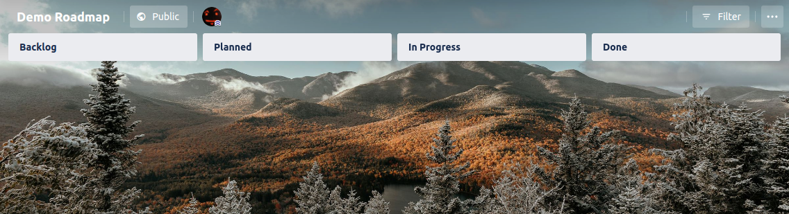

Charmed Kubernetes® is pure Kubernetes tested across the widest range of clouds with modern metrics and monitoring, brought to you by the people who deliver Ubuntu.

Google, Microsoft, and many other institutions run Kubernetes on Ubuntu because we focus on the latest container capabilities in modern kernels. That’s why it’s the top choice for enterprise Kubernetes, too.

## Deploying Charmed Kubernetes®

To learn more about **Charmed Kubernetes**®, including how to install it on your own cloud, please visit the [Documentation][docs].

## Professional support

Professional upport for **Charmed Kubernetes**® is covered by **Ubuntu Pro**, which doesn't just cover Kubernetes, but your entire stack - Find out more on the [Ubuntu support site](https://ubuntu.com/support).

## Contributing to Charmed Kubernetes®

Charmed Kubernetes is an open source project and we welcome contributions of code, additions to the documentation, feature requests and any and all types of feedback. For more on contributing, see the [official documentation][get-in-touch] on how to contact the team.

<!-- LINKS -->
[docs]: https://ubuntu.com/kubernetes/docs
[get-in-touch]: https://ubuntu.com/kubernetes/docs/get-in-touch

### Latest activity

<!-- activity starts -->
 - [@neoaggelos](https://github.com/neoaggelos) has pushed the commit **Start clusterapi test and release job** to [jenkins](https://github.com/charmed-kubernetes/jenkins)
 - [@neoaggelos](https://github.com/neoaggelos) has pushed the commit **Start clusterapi test and release job** to [jenkins](https://github.com/charmed-kubernetes/jenkins)
 - [@neoaggelos](https://github.com/neoaggelos) has pushed the commit **Start clusterapi test and release job** to [jenkins](https://github.com/charmed-kubernetes/jenkins)
 - [@neoaggelos](https://github.com/neoaggelos) has pushed the commit **Start clusterapi test and release job** to [jenkins](https://github.com/charmed-kubernetes/jenkins)
 - [@neoaggelos](https://github.com/neoaggelos) has pushed the commit **Start clusterapi test and release job** to [jenkins](https://github.com/charmed-kubernetes/jenkins)
 - [@neoaggelos](https://github.com/neoaggelos) has pushed the commit **Start clusterapi test and release job** to [jenkins](https://github.com/charmed-kubernetes/jenkins)
 - [@neoaggelos](https://github.com/neoaggelos) has pushed the commit **Start clusterapi test and release job** to [jenkins](https://github.com/charmed-kubernetes/jenkins)
 - [@neoaggelos](https://github.com/neoaggelos) has pushed the commit **Start clusterapi test and release job** to [jenkins](https://github.com/charmed-kubernetes/jenkins)
 - [@neoaggelos](https://github.com/neoaggelos) has pushed the commit **[draft] Start clusterapi test and release job** to [jenkins](https://github.com/charmed-kubernetes/jenkins)
 - [@neoaggelos](https://github.com/neoaggelos) has pushed the commit **[draft] Start clusterapi test and release job** to [jenkins](https://github.com/charmed-kubernetes/jenkins)
<!-- activity ends -->

### Roadmap

Visit the public roadmap on [Trello](https://trello.com/b/Pfu4BlRO/demo-roadmap)

### Latest from the Ubuntu blog

<!-- blog starts -->
* [What? The Steam snap is evolving!](https://ubuntu.com//blog/what-the-steam-snap-is-evolving) - Fri, 21 Oct 2022 09:06:51 
* [What&#8217;s new in Ubuntu Desktop 22.10, Kinetic Kudu](https://ubuntu.com//blog/whats-new-in-ubuntu-desktop-22-10-kinetic-kudu) - Fri, 21 Oct 2022 09:00:13 
* [Integrating Charmed Kubernetes with AWS via OIDC](https://ubuntu.com//blog/integrating-charmed-kubernetes-with-aws-via-oidc) - Fri, 21 Oct 2022 04:27:09 
* [Join our Ubuntu circle](https://ubuntu.com//blog/join-our-ubuntu-circle) - Thu, 20 Oct 2022 20:00:52 
* [Landscape beta: test the Landscape Server migration to Ubuntu 22.04 LTS](https://ubuntu.com//blog/landscape-beta-test-the-landscape-server-migration-to-ubuntu-22-04-lts) - Thu, 20 Oct 2022 14:02:25 
* [Ubuntu 22.10 on the Raspberry Pi delivers new display support and the full MicroPython stack](https://ubuntu.com//blog/ubuntu-22-10-on-the-raspberry-pi-delivers-new-display-support-and-the-full-micropython-stack) - Thu, 20 Oct 2022 14:01:33 
<!-- blog ends -->
